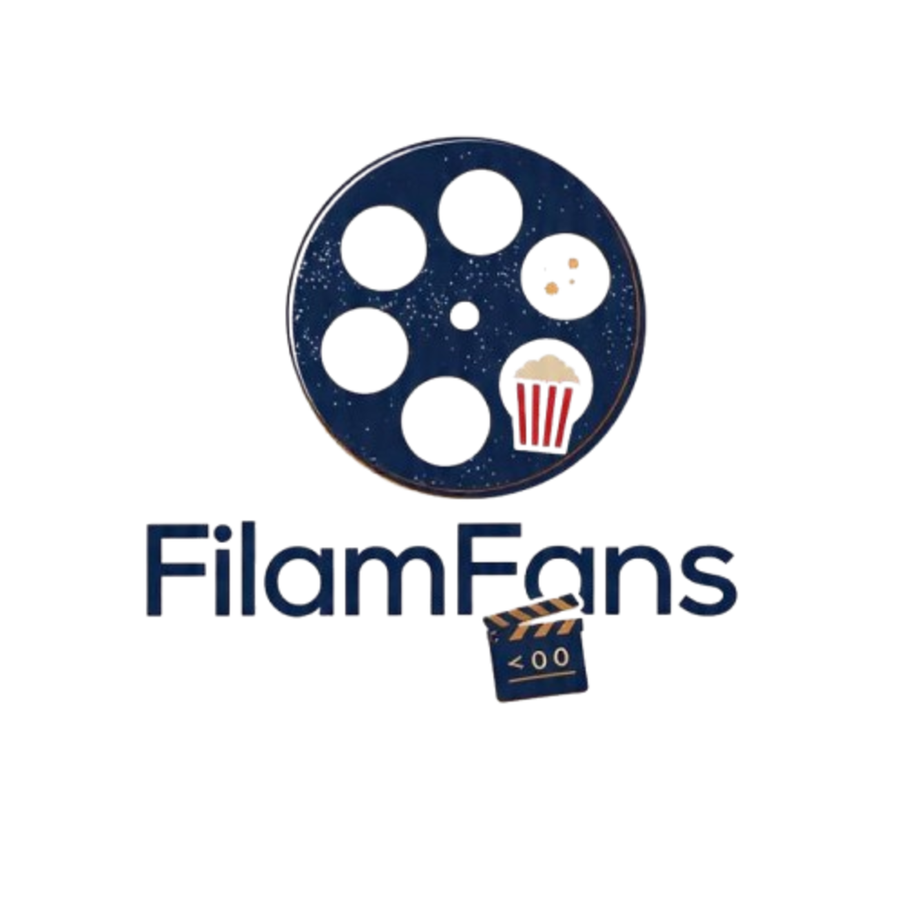

<p align="center">
  
</p>

<h1 align="center">FilmFans</h1>
<p align="center">🎬 Your ultimate Android app for streaming movies & series — ad-free.</p>

<p align="center">
  <a href="https://t.me/Filmfansmovie">
    
  </a>
</p>

---

## 📖 About

**FilmFans** is a fork of [Vega App](https://github.com/Zenda-Cross/vega-app) by **Zenda-Cross**, rebuilt and maintained by **Rounak** (Dev) under the ownership of **omijj**. Full credit and gratitude goes to Zenda-Cross for the incredible foundation this project is built on.

---

## ✨ Features

- 🎬 Stream and Download **Ad-Free**
- 🌐 Multiple sources for movies & series
- 🌍 Multi Audio & Subtitles (Hindi, English, and more)
- 📋 Personal WatchList
- 📥 External Player & Downloader support

---

## 📦 Download


> **Note:** Download the Universal version if you're unsure whether to pick `armeabi-v7a` or `arm64-v8a`.

[](https://github.com/Zenda-Cross/vega-app/releases/latest)

---

## 📸 Screenshots


---

## 🛠️ Tech Stack

<p align="left">
  <a href="https://reactnative.dev/"></a>
  <a href="https://www.typescriptlang.org/"></a>
  <a href="https://www.nativewind.dev/"></a>
  <a href="https://reactnavigation.org/"></a>
  <a href="https://docs.expo.dev/modules/overview/"></a>
  <a href="https://thewidlarzgroup.github.io/react-native-video/"></a>
  <a href="https://github.com/mrousavy/react-native-mmkv"></a>
</p>

---

## 🚀 Build & Development

**0.** Set up your React Native environment → [Guide](https://reactnative.dev/docs/set-up-your-environment)

**1. Clone the repo**
```bash
git clone https://github.com/Zenda-Cross/vega-app.git
cd vega-app
```

**2. Install dependencies**
```bash
npm install
```

**3. Prebuild**
```bash
npx expo prebuild -p android --clean
```

**4. Run (Dev)**
```bash
npm run android
```

**5. Build APK/AAB**

Follow the official guide: https://reactnative.dev/docs/signed-apk-android

---

## 👥 Credits

| Role | Person |
|------|--------|
| App Owner | **omijj** |
| Developer | **Rounak** |
| Original Creator (Vega App) | [**Zenda-Cross**](https://github.com/Zenda-Cross/vega-app) ❤️ |

Special thanks to **Zenda-Cross** for building the original Vega App that made FilmFans possible.

---

> [!IMPORTANT]
> FilmFans does not store any media files on its servers and is not directly linked to any media content. All media is hosted by third-party services. FilmFans merely provides a search and web scraping tool that indexes publicly available data. We are not responsible for the content or availability of any media, as we do not host or control it.

---

## ⭐ Star History

<picture>
  <source media="(prefers-color-scheme: dark)" srcset="https://api.star-history.com/svg?repos=Zenda-Cross/vega-app&type=Date&theme=dark" />
  <source media="(prefers-color-scheme: light)" srcset="https://api.star-history.com/svg?repos=Zenda-Cross/vega-app&type=Date" />
  
</picture>
